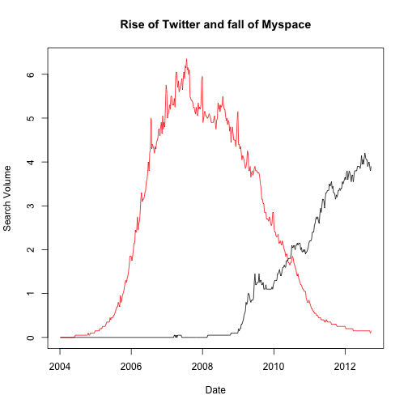
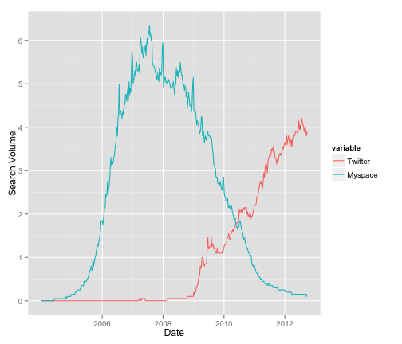
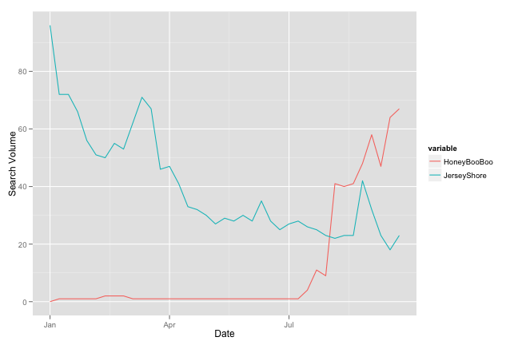

rGtrends tutorial
========================================================

rGtrends is an R wrapper for making calls to [Google Trends](http://www.google.com/trends) it automatically calls a python api which downloads a temporary CSV.  As of 9/27/2012 google changed it's interface for trends and the python component needs to be retooled for finer parsing.  As it stands now only raw data is downloaded with the ability to sort by date.  But once the python api is fixed individual sections can be downloaded.  


Installation
----
Installation can be done one of two ways.  
### Method 1 

The first is via [devtools](http://github.com/hadley/devtools):

1. Download devtools
2. run the following snippet:

```r
require(devtools)
install_github("rGtrends", "emhart")
library(rGtrends)
```


### Methods 2:

1. Download the zipped source from [github](https://github.com/emhart/rGtrends/zipball/master)
2. Install the zip file with your preferred method, from within the R GUI, or the command line "`R CMD INSTALL (unzipped directory)`"

Examples
----

Once you have successfully installed rGtrends using it is easy.  The function takes two inputs, a vector of search terms and a vector that is a beginning and end date to search, which defaults to the entire range returned (since 2004).  Here's a basic example:


```r
library(rGtrends)

my_terms <- c("Twitter", "Myspace")
twit_ms <- rGtrends(my_terms)
#### Often a 0 is returned for the week in progress, we can cut this out.
twit_ms <- twit_ms[-dim(twit_ms)[1], ]

plot(twit_ms[, 1], twit_ms[, 3], type = "l", col = 2, xlab = "Date", 
    ylab = "Search Volume", main = "Rise of Twitter and fall of Myspace")
lines(twit_ms[, 1], twit_ms[, 2])
```

 


You may have noticed that the search takes a bit of time.  After profiling the code much of this is due to issues with google's response time and downloading the CSV file.  Most searches take on the order of 30 seconds.  

You can also use `melt()` from the [reshape package](http://had.co.nz/reshape/) to visualize data using [ggplot2](http://ggplot2.org/).

```r
library(ggplot2)
library(reshape)

gg_df <- melt(twit_ms[, 2:3])
gg_df$Date <- rep(twit_ms[, 1], 2)

ggplot(gg_df, aes(x = Date, y = value, colour = variable)) + geom_path() + 
    ylab("Search Volume")
```

 


The date range is specified as either "all", or a date in YYYY-MM format as a string. For instance to search from January 2005 to September 2008, your date vector would look like: `date_vec <- c("2005-01","2008-09")`  If you wanted all searches since 2005, you would have the 2nd date position be "all": `date_vec <- c("2005-01","all")`
Here's an example where we can see the rise in popularity for the show Honey Boo Boo, and the fall of my dearly loved Jersey Shore.  Let's check since 2012.


```r

my_terms <- c("Honey Boo Boo", "Jersey Shore")
date_range <- c("2012-01", "all")
tv_dat <- rGtrends(my_terms, date = date_range)
#### Often a 0 is returned for the week in progress, we can cut this out.
tv_dat <- tv_dat[-dim(tv_dat)[1], ]


gg_df <- melt(tv_dat[, 2:3])
gg_df$Date <- rep(tv_dat[, 1], 2)

ggplot(gg_df, aes(x = Date, y = value, colour = variable)) + geom_path() + 
    ylab("Search Volume")
```

 


The plot shows how Jersey Shore's popularity is waning, but Honey Boo Boo is a rising star (If these don't mean anything to you consider yourself lucky). Our output is also the same as what you can find from google's website.


### Caveat
Be sure you understand how the results are being returned.  To get an idea of what exactly search volume is, read [Google's full documentation:](http://www.google.com/intl/en/trends/about.html).  All the results are scaled, so all comparisons must be done within a single search if you want to really be able to compare them accurately.  Secondly you're limited to 5 keywords in one search.  Before the update search data could be returned in raw format, and I'm not sure there's a way to get that back. Other than that, happy trending.
